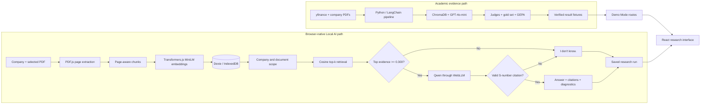

# DualLens Research Lab

Trustworthy, local-first AI investment research.

DualLens is an evidence-oriented research application that combines financial context with
company-document analysis, retrieval, grounded generation, evaluation, and confidence routing. It
began as an academic Jupyter experiment and evolved into an independent React application that can
index PDFs, retrieve evidence, and run a small language model entirely in the browser.

The project is built around a simple principle: **a plausible answer is not necessarily a
trustworthy answer**. DualLens keeps retrieved passages, citations, evaluation results, known
failure modes, and the final review route visible instead of treating a fluent model response as
the end of the workflow.

> **Project status:** The four engineering phases are complete and version `1.0.0` is locally
> validated. A GitHub Pages release is prepared but is not live. Public release remains pending
> repository-history sanitization and resolution of the documented dependency-audit blocker. See
> [Public release safety](docs/public-release-safety.md) and [Security](SECURITY.md).

## Table of contents

- [Overview](#overview)
- [From academic experiment to portfolio product](#from-academic-experiment-to-portfolio-product)
- [Why the architecture changed](#why-the-architecture-changed)
- [Product modes and workflows](#product-modes-and-workflows)
- [Architecture](#architecture)
- [Academic vs. portfolio architecture](#academic-vs-portfolio-architecture)
- [Product areas](#product-areas)
- [Measured academic results](#measured-academic-results)
- [GEPA: measurable prompt optimization](#gepa-measurable-prompt-optimization)
- [Browser-native Local AI](#browser-native-local-ai)
- [Grounded RAG and guardrails](#grounded-rag-and-guardrails)
- [Retrieval failure vs. generation failure](#retrieval-failure-vs-generation-failure)
- [Local-first storage, privacy, and portability](#local-first-storage-privacy-and-portability)
- [Technology stack](#technology-stack)
- [Engineering decisions](#engineering-decisions)
- [What this project demonstrates](#what-this-project-demonstrates)
- [Testing and quality gates](#testing-and-quality-gates)
- [Performance strategy](#performance-strategy)
- [Running the project locally](#running-the-project-locally)
- [Using Demo Mode](#using-demo-mode)
- [Using Local AI Mode](#using-local-ai-mode)
- [Browser compatibility](#browser-compatibility)
- [Limitations](#limitations)
- [Repository structure](#repository-structure)
- [Academic materials and public safety](#academic-materials-and-public-safety)
- [Deployment](#deployment)
- [Status and future work](#status-and-future-work)
- [Why DualLens matters](#why-duallens-matters)
- [Documentation](#documentation)
- [License and attribution](#license-and-attribution)

## Overview

AI-assisted investment research has two distinct evidence problems. Quantitative data describes
scale, valuation, and market behavior; corporate documents describe strategy, initiatives,
timelines, and risks. Combining both can be useful, but an LLM can also retrieve the wrong company,
answer from weak context, omit the requested fact, or present uncertainty as confidence.

DualLens separates those concerns into inspectable stages. The Financial Lens and Narrative Lens
remain distinct until the decision layer. Retrieval is scoped and diagnosed before generation.
Generated claims must cite retrieved excerpts. Objective gold-set checks and rubric-based judges
measure different aspects of quality. The final recommendation is routed according to measured
signals instead of being automatically accepted.

This is therefore more than a chatbot interface. It is a case study in evaluation-driven RAG,
failure analysis, trust-oriented UX, browser-native AI, local persistence, and the architectural
translation of a notebook experiment into a maintainable software product.

## From academic experiment to portfolio product

### Original academic experiment

The project started as a Jupyter-based academic implementation covering Alphabet (`GOOGL`),
Microsoft (`MSFT`), IBM (`IBM`), NVIDIA (`NVDA`), and Amazon (`AMZN`). It implemented:

- a three-year `yfinance` price-history comparison and a financial metrics snapshot;
- ingestion of one AI-initiative PDF per company;
- 512-token chunks with 64-token overlap and preserved company metadata;
- OpenAI `text-embedding-3-small` embeddings and a ChromaDB collection;
- LangChain retrieval and grounded `gpt-4o-mini` answers;
- company-filtered and unfiltered retrieval diagnostics;
- three LLM-as-Judge rubrics: Groundedness, Context Relevance, and Answer Relevance;
- a 20-question objective gold set;
- a stratified 12-question training / 8-question held-out evaluation design;
- DSPy and GEPA prompt/program optimization;
- financial-plus-narrative fused ranking and confidence routing.

➡️ [Open the original academic Jupyter notebook](notebooks/academic/Week5-Project-DualLens_Analytics_Project_1_Learners_Notebook.ipynb)

The notebook remains preserved as historical and technical evidence of the first DualLens system.
The web application is an independent portfolio continuation of that work: it does not execute the
notebook in the browser and is not a thin frontend around Python cells.

### The evolution

```text
Academic Jupyter project
        ↓
Evaluation-driven RAG experiment
        ↓
Measured retrieval and generation weaknesses
        ↓
DSPy + GEPA optimization on a training split
        ↓
Held-out evaluation and confidence routing
        ↓
Portfolio product redesign
        ↓
Browser-native Local AI research application
```

The portfolio product preserves verified experiment outputs in Demo Mode and reimplements the
interactive document workflow with browser technologies. The academic and product architectures
are intentionally separate because they solve different problems.

## Why the architecture changed

A notebook is an effective environment for transparent experimentation: cells make data loading,
retrieval, evaluation, and optimization easy to inspect and rerun. It is less suited to a
no-setup, recruiter-facing application with durable user data, responsive navigation, explicit
failure states, and predictable deployment.

The academic cloud-assisted architecture was appropriate for measuring the research hypothesis.
The portfolio target introduced different constraints:

- no backend or server-side runtime;
- no cloud database, account system, or authentication;
- no API credential required by the web application;
- no paid inference API or recurring application-owner inference cost;
- an immediate demonstration path with no model download;
- an optional, functional Local AI path that proves the browser implementation;
- static hosting from a repository subpath.

Those constraints led to React and TypeScript for the product surface, IndexedDB for persistence,
Transformers.js for local embeddings, explicit cosine retrieval, and WebLLM for generation. Demo
Mode solves presentation and reproducibility; Local AI Mode solves real browser-native execution.

## Product modes and workflows

### Demo Mode

Demo Mode is the default, read-only product walkthrough. It loads instantly, requires no AI model
download, and presents typed fixtures derived from the verified academic run. It does not claim to
show live financial prices or live model inference.

It lets a reviewer inspect:

- the academic financial snapshot and five-company comparison;
- narrative initiative coverage and page metadata;
- recorded grounded and abstaining RAG examples;
- filtered/unfiltered retrieval diagnostics;
- LLM-as-Judge results and gold-set failures;
- the held-out GEPA before/after result;
- the fused ranking, confidence inputs, and final `FLAGGED` route.

### Local AI Mode

Local AI Mode implements the document-to-answer path in the browser:

```text
Create or select a company
        ↓
Upload a text-based PDF
        ↓
Extract pages locally with PDF.js
        ↓
Create deterministic, page-aware chunks
        ↓
Generate local MiniLM embeddings in WASM
        ↓
Persist metadata, text, and vectors in IndexedDB
        ↓
Retrieve company/document-scoped evidence by cosine similarity
        ↓
Apply the evidence-sufficiency guardrail
        ↓
Load Qwen through WebLLM and ask a question
        ↓
Enforce citations and save diagnostics
```

Indexing and retrieval do not require WebGPU. Grounded answer generation does, and the language
model must be loaded explicitly by the user.

## Architecture



The application shell uses lazy route modules and typed domain contracts. Demo fixtures are
immutable and never mixed into the local workspace. PDF, embedding, and generation runtimes are
dynamically initialized only when their workflows need them.

For implementation boundaries and data flow, see [Architecture](docs/architecture.md).

## Academic vs. portfolio architecture

| Area             | Academic experiment                                        | Portfolio application                                                     |
| ---------------- | ---------------------------------------------------------- | ------------------------------------------------------------------------- |
| Goal             | Test an evaluation-driven RAG hypothesis                   | Deliver an inspectable, no-backend research product                       |
| Runtime          | Python 3.11 / Jupyter                                      | React 19 / TypeScript 6 in the browser                                    |
| Financial data   | `yfinance` three-year history plus run-time metrics        | Preserved academic snapshot; no live market feed                          |
| Document loading | PyPDF / LangChain                                          | PDF.js, page by page                                                      |
| Chunking         | 512 tokens, 64-token overlap                               | 1,000 characters, 200-character overlap, no cross-page chunks             |
| Embeddings       | OpenAI `text-embedding-3-small`                            | MiniLM via Transformers.js, q8/WASM                                       |
| Vector storage   | ChromaDB                                                   | Embeddings and chunks in Dexie/IndexedDB                                  |
| Retrieval        | LangChain similarity search with optional company metadata | Explicit cosine ranking with required company and optional document scope |
| Generation       | Hosted `gpt-4o-mini`                                       | Local Qwen through WebLLM/WebGPU                                          |
| Evaluation       | LLM judges, objective gold set, held-out GEPA experiment   | Academic results in Demo Mode; deterministic local run diagnostics        |
| Persistence      | Notebook variables and exported artifacts                  | Versioned browser schema and portable JSON workspace                      |
| Credentials      | Required for the academic API workflow                     | None required by the web application                                      |
| Deployment       | Notebook / HTML artifact                                   | Static Vite build prepared for GitHub Pages                               |

## Product areas

### Financial Lens

The notebook performed a three-year daily closing-price comparison and captured market
capitalization, P/E, beta, dividend yield, and revenue metrics. The web Financial Lens exposes the
verified five-company snapshot, selectable metric comparisons, and the recorded ranking context.
It labels the data as historical experiment input and never presents it as a live valuation model.

### Narrative Lens

Demo Mode maps named AI initiatives to the company document pages and chunk coverage recorded in
the academic corpus. Local AI Mode lets the user inspect their own indexed documents, extracted
pages, chunk metadata, similarity results, and sufficiency state.

### RAG Assistant

The assistant requires a selected company, searches only ready chunks created by the configured
embedding model, and can optionally narrow retrieval to selected documents. A supported local
answer must use retrieved evidence and include valid `[S#]` references; otherwise the stored answer
is exactly `I don't know.`. Each citation opens the corresponding filename, page, chunk, and
similarity evidence.

### Retrieval Diagnostics

The diagnostics surface top-k ordering, cosine similarity, company scope, document scope, the
`0.300` sufficiency threshold, retrieval latency, evidence count, and citation coverage. In Demo
Mode, the page also explains why equal filtered/unfiltered hit rates do not make metadata filtering
redundant: the filter is a deterministic isolation boundary, while the measured unfiltered purity
was a property of one question set.

### Evaluation Lab and Gold Set

The academic evaluation separates Groundedness, Context Relevance, and Answer Relevance. A
20-question gold set adds an objective expected-substring signal, and the interface exposes both
passes and designed failure cases. Local AI runs store deterministic retrieval/citation diagnostics
rather than pretending that a cloud LLM judge ran in the browser.

### GEPA Optimization

The optimization view preserves the DSPy/GEPA experiment, including the minimal v1 prompt, the
evolved v2 behavior, changed cases, and the held-out comparison. GEPA is part of the academic
experiment; the browser application reports its verified result and does not rerun GEPA locally.

### Decision Layer

The saved academic decision combines financial metrics with retrieval-built narrative digests,
requires both forms of evidence in each ranked rationale, and judges ranking groundedness. A
weighted score then routes the deliverable as client-ready, flagged, or held for human review. The
recorded result is `79/100 — FLAGGED`, one point below the client-ready threshold.

### Local Workspace

The workspace manages companies, document metadata, chunks, embeddings, research runs,
evaluations, and settings in IndexedDB. It supports document deletion/reindexing, capability and
storage inspection, validated export/import, persistent-storage requests, and an explicitly
confirmed clear operation.

## Measured academic results

The following values come from the preserved notebook outputs and academic artifacts. The baseline
and held-out rows are different evaluation slices, not consecutive readings of one metric.

| Evaluation slice              |                                         Verified result | What it measures                                                     |
| ----------------------------- | ------------------------------------------------------: | -------------------------------------------------------------------- |
| Corpus                        | 5 companies · 44 PDF pages · 138 metadata-tagged chunks | Original narrative evidence base                                     |
| Filtered retrieval hit rate   |                                                     75% | Expected token reached top-k context with company filter             |
| Unfiltered retrieval hit rate |                                                     75% | Expected token reached top-k context without filter                  |
| Unfiltered company purity     |                                                     96% | Share of returned chunks from the correct company in that diagnostic |
| Full gold baseline            |                                             11/20 = 55% | Objective v1 answer accuracy across all gold questions               |
| Held-out v1                   |                                               4/8 = 50% | Baseline prompt on the eight examples hidden from GEPA               |
| Held-out v2                   |                                             5/8 = 62.5% | Optimized program on the same held-out examples                      |
| LLM-as-Judge mean             |                                                     80% | Mean in-scope rubric signal used by confidence routing               |
| Ranking groundedness          |                                              5/5 = 100% | Judge score for the saved fused recommendation                       |
| Final confidence              |                                                  79/100 | Weighted 40% gold, 30% judge mean, 30% ranking groundedness          |
| Final route                   |                                             **FLAGGED** | Human review required before delivery                                |

The confidence thresholds were `>= 80` client-ready, `60–79` flagged, and `< 60` held for human
review. These are explicit research policies, not statistically calibrated probabilities.

## GEPA: measurable prompt optimization

The v1 prompt produced `4/8 = 50%` on the held-out split. DSPy represented retrieval plus generation
as a typed program, while GEPA used deterministic expected-substring scores and actionable failure
feedback to evolve the instructions. The optimizer saw 12 stratified training questions; the final
comparison used the eight examples it had never seen.

| Prompt/program       |             Held-out result |
| -------------------- | --------------------------: |
| v1 baseline          |                   4/8 = 50% |
| v2 GEPA              |                 5/8 = 62.5% |
| Absolute improvement | **+12.5 percentage points** |

GEPA corrected the IBM Guardium case without a held-out regression. Trainium, Flamingo, and Quantum
remained retrieval-bound misses. That distinction matters: the result shows a measurable prompt
improvement while also exposing the ceiling imposed by unchanged retrieval.

## Browser-native Local AI

### Document processing and chunking

| Setting            | Implementation                                             |
| ------------------ | ---------------------------------------------------------- |
| Input              | Text-based PDF, 25 MB maximum                              |
| Extraction         | PDF.js, one page at a time                                 |
| Chunk size         | 1,000 characters                                           |
| Overlap            | 200 characters                                             |
| Boundary selection | Prefers paragraph, sentence, newline, then word boundaries |
| Page handling      | Page boundaries preserved; chunks never cross pages        |
| Version            | `chars-v1-1000-200`                                        |

Page-preserving chunks make citations stable: each retrieved vector maps to one document page rather
than an ambiguous span assembled across pages. Scanned or image-only PDFs require OCR and are
rejected when no readable text can be extracted.

### Embeddings

| Setting             | Value                                  |
| ------------------- | -------------------------------------- |
| Model               | `onnx-community/all-MiniLM-L6-v2-ONNX` |
| Runtime             | Transformers.js / ONNX browser runtime |
| Execution           | WASM                                   |
| Precision           | q8                                     |
| Pooling             | Mean                                   |
| Normalization       | Enabled                                |
| Dimension           | 384                                    |
| Indexing batch size | 8                                      |

Model loading is deferred until indexing or retrieval begins. A ready document records its model,
dimension, and chunking version so incompatible vectors are excluded from later searches.

### Retrieval

| Setting               | Value                                                  |
| --------------------- | ------------------------------------------------------ |
| Similarity            | Cosine similarity                                      |
| Default top-k         | 4                                                      |
| Required scope        | Company                                                |
| Optional scope        | Selected document IDs                                  |
| Candidate constraints | Ready document, matching embedding model and dimension |
| Sufficiency rule      | Highest-ranked similarity `>= 0.300`                   |

The `0.300` threshold is an operational heuristic, not a calibrated confidence score. It creates a
clear abstention boundary for this research application and should be reevaluated for a different
model, corpus, or domain.

### Local generation

| Setting                    | Value                               |
| -------------------------- | ----------------------------------- |
| Model                      | `Qwen2.5-1.5B-Instruct-q4f16_1-MLC` |
| Runtime                    | WebLLM                              |
| Execution                  | WebGPU                              |
| Configured context window  | 4,096 tokens                        |
| Generation limit           | 400 tokens                          |
| Temperature / top-p        | `0.2` / `0.9`                       |
| Approximate first download | 880 MB                              |
| Approximate reported VRAM  | 1.63 GB                             |

The user must explicitly load the model. Loading progress, unsupported hardware, runtime errors,
interrupt, and unload states are visible in the interface.

## Grounded RAG and guardrails

DualLens implements several complementary controls. They reduce risk; they are not a claim of
complete prompt-injection prevention or production financial-advice readiness.

- **Company filtering.** Local retrieval requires a company ID, preventing cross-company evidence
  from entering the candidate pool. Optional document selection narrows that scope further.
- **Evidence sufficiency.** If the top retrieved score is below `0.300`, generation is skipped.
- **Explicit abstention.** Unsupported or empty output becomes exactly `I don't know.`.
- **Grounded prompt.** The model is instructed to use only supplied source excerpts, avoid outside
  knowledge and invented recommendations, and distinguish evidence from interpretation.
- **Untrusted-document treatment.** The prompt labels excerpts as data, instructs the model to
  ignore instructions found inside documents, and therefore mitigates document-borne prompt
  injection.
- **Citation enforcement.** Supported claims must reference source labels such as `[S1]`. If a
  non-abstaining answer contains no valid in-range reference, the application rejects it and stores
  `I don't know.` instead.
- **Inspectable provenance.** Valid labels resolve to the retrieved chunk, filename, page, rank,
  text, and similarity score.
- **Human routing.** Academic confidence policy keeps borderline recommendations out of the
  client-ready route.

## Retrieval failure vs. generation failure

Separating these failure modes was one of the central lessons of the notebook:

- A **retrieval failure** occurs when the required evidence never enters the model context. Prompt
  changes cannot recover a fact that was not retrieved; chunking, query construction, hybrid
  search, top-k, or reranking must change.
- A **generation failure** occurs when the correct evidence is present but the model ignores,
  misreads, or fails to name it. Prompt/program optimization can improve this class of failure.

In the full 20-question v1 baseline, five misses were retrieval gaps and four occurred even though
the expected token was present in context. That analysis justified using GEPA for generation
behavior while interpreting its residual misses as retrieval-bound rather than hiding them inside
one aggregate accuracy number.

## Local-first storage, privacy, and portability

### What local-first means here

Dexie manages a versioned IndexedDB database containing:

- companies and notes;
- document metadata and indexing status;
- page-aware chunks and 384-dimensional embeddings;
- research runs, retrieved evidence, citations, and diagnostics;
- deterministic evaluation records and workspace settings.

Index completion is transactional: the ready document and its chunks are committed together. The
schema has an explicit v1-to-v2 migration path, repository abstractions, entity relationships, and
cascade behavior covered by tests.

The web application does not require a backend, cloud database, user account, authentication,
analytics service, or inference API key. There is no cross-device synchronization.

### Privacy boundary

Selected PDF bytes are read in the browser. Extracted text, embeddings, questions, answers, and run
history remain in the current browser workspace and are not sent to an inference API. Original PDF
blobs are not retained after indexing.

This does **not** mean the application makes no network requests. Transformers.js and WebLLM model
assets are downloaded from their configured hosting origins on first use and may be cached by the
browser. The user's browser/device bears that network transfer and computation.

### Workspace portability

- **Export Workspace** creates a versioned JSON file containing local records, chunks, embeddings,
  research runs, evaluations, and settings.
- **Import Workspace** validates structure and relationships with Zod, then replaces the current
  workspace only after explicit confirmation.
- **Clear Workspace** reports the affected record counts and requires confirmation.

Exports deliberately exclude original PDFs, model weights, browser model caches, secrets, and Demo
Mode fixtures. Export/import provides user-controlled portability in place of accounts or cloud
synchronization.

## Technology stack

| Purpose             | Technologies                                                                           | Role in DualLens                                                                    |
| ------------------- | -------------------------------------------------------------------------------------- | ----------------------------------------------------------------------------------- |
| Frontend            | React 19, React Router, Vite 8, TypeScript 6                                           | Routed application shell, strict domain contracts, static build                     |
| Interface system    | Tailwind CSS 4, shadcn/ui patterns, Radix Slot, Lucide                                 | Responsive research UI, accessible primitives, icons, focus states                  |
| Data visualization  | Recharts                                                                               | Financial comparison and analytical views with accompanying text/table alternatives |
| Document processing | PDF.js                                                                                 | Browser-side page extraction with a dedicated worker                                |
| Local embeddings    | Transformers.js, ONNX browser runtime, WASM                                            | q8 MiniLM feature extraction and normalized vectors                                 |
| Local generation    | WebLLM, WebGPU                                                                         | Explicitly loaded Qwen chat completion in the browser                               |
| Retrieval           | Cosine similarity, metadata/model/dimension filtering                                  | Deterministic company- and document-scoped top-k evidence ranking                   |
| Storage             | IndexedDB, Dexie                                                                       | Versioned local persistence, transactions, repositories, migrations                 |
| Validation          | Zod                                                                                    | Typed Demo fixture checks and strict workspace import validation                    |
| Testing and quality | Vitest, React Testing Library, jsdom, fake-indexeddb, ESLint, Prettier                 | Unit, integration, UI, storage, and static quality gates                            |
| Academic experiment | Python, Jupyter, pandas, matplotlib, yfinance, LangChain, ChromaDB, OpenAI, DSPy, GEPA | Original financial/RAG experiment, evaluation, optimization, and decision evidence  |

## Engineering decisions

| Decision                             | Rationale                                                                                                              |
| ------------------------------------ | ---------------------------------------------------------------------------------------------------------------------- |
| No backend or authentication         | Reduces recurring infrastructure cost, secret management, and privacy exposure for a single-user research workspace.   |
| IndexedDB through Dexie              | Provides structured, high-capacity browser persistence, transactions, and schema migration without a cloud database.   |
| Transformers.js embeddings           | Makes the local index functional without an embedding API and keeps vectors reproducible under a recorded model ID.    |
| WebLLM generation                    | Demonstrates local inference and avoids a paid generation endpoint while keeping model lifecycle visible.              |
| Demo Mode by default                 | Gives every reviewer an immediate, deterministic walkthrough without requiring capable hardware or an 880 MB download. |
| Local AI as an opt-in mode           | Proves the browser-native pipeline while setting honest expectations about compatibility and resource use.             |
| Required company scope               | Turns company isolation into an enforced retrieval invariant rather than a prompt suggestion.                          |
| Exact abstention contract            | Converts weak evidence and missing citations into a visible, testable failure state.                                   |
| Provider and repository abstractions | Keep UI/domain code from depending directly on a particular model runtime or storage query.                            |
| Dynamic imports and lazy routes      | Keep heavy AI, PDF, and analytical modules outside the initial critical path where practical.                          |
| Hash routing and relative Vite base  | Support static subpath hosting without a server-side route fallback or owner-specific base path.                       |
| Preserve the notebook separately     | Keeps the experiment auditable without coupling Python execution to the production-style web architecture.             |

The rationale and trade-offs are recorded in the [architecture decision records](docs/decisions),
including [ADR-005: Static GitHub Pages deployment](docs/decisions/ADR-005-static-github-pages.md).

## What this project demonstrates

### AI engineering

DualLens implements two RAG architectures and makes their trade-offs explicit: embedding creation,
metadata-aware vector retrieval, prompt assembly, grounded generation, citation resolution,
abstention, document-borne prompt-injection mitigation, and local inference.

### LLM evaluation

The project combines LLM-as-Judge rubrics with an objective gold set, held-out testing, retrieval
purity, failure classification, ranking groundedness, and confidence routing. It also shows why a
correct abstention can receive a low generic judge score and why multiple signals are necessary.

### Prompt and program optimization

DSPy converts the RAG path into a typed program; GEPA evolves instructions from deterministic
feedback; a stratified held-out split distinguishes generalization from training-set prompt
tweaking. The reported improvement is modest, measurable, and bounded by retrieval failures.

### Frontend engineering

The application uses feature-oriented React modules, strict TypeScript domain models, fourteen
lazy-loaded routes, responsive navigation, loading and error boundaries, an explicit 404 route,
analytical visualizations, evidence inspectors, keyboard-visible focus, reduced-motion behavior,
and labels that distinguish historical/demo data from local execution.

### Browser AI

The Local AI path covers WebAssembly embedding inference, WebGPU capability detection, explicit
WebLLM model loading, progress reporting, cancellation/interrupt behavior, runtime fallback, model
metadata, and resource-aware UX.

### Data and storage engineering

The local workspace demonstrates IndexedDB schema design, Dexie migrations and transactions,
repository patterns, cascades, atomic reindexing, versioned export/import, relationship validation,
storage quotas, and recovery-oriented user controls.

### Software engineering

The repository includes provider abstractions, typed fixture validation, colocated unit and
integration tests, CI, formatting/lint/type gates, static deployment workflows, security and
dependency review, third-party notices, ADRs, and release documentation.

### Product thinking

Demo Mode and Local AI Mode address different reviewer needs without misrepresenting either one.
The UX emphasizes evidence, known limitations, failure states, privacy boundaries, zero-backend
operation, and human review—not simulated certainty.

## Testing and quality gates

The current automated suite passes **58 tests across 16 test files**. This is a verified test count,
not a claim of complete coverage.

Covered areas include:

- deterministic page-aware chunking, overlap, and boundary validation;
- cosine similarity, company/document filtering, model compatibility, ordering, and sufficiency;
- actual PDF.js text extraction plus PDF validation/normalization;
- q8/WASM embedding-provider configuration and vector dimensions with mocked model execution;
- end-to-end indexing/retrieval/RAG integration through controlled providers;
- insufficient-evidence and missing-citation `I don't know.` behavior;
- grounding, source-instruction, citation, and advice rules in the prompt contract;
- IndexedDB CRUD, migrations, cascades, transactional reindexing, and workspace counts;
- export/import round trips, malformed-data rejection, and relationship validation;
- browser capability detection, no-WebGPU retrieval fallback, and disabled generation;
- application routing, mode switching, 404 handling, and destructive confirmation behavior.

Real model downloads and WebGPU/WebLLM execution are not exercised by the automated suite. They
require a compatible networked browser and device and must not be inferred from mocked tests.

## Performance strategy

The initial application shell does not eagerly initialize local models. Feature routes are loaded
on demand, Transformers.js and WebLLM use dynamic imports, PDF.js selects its browser/legacy runtime
at extraction time, and indexing embeds chunks in batches of eight. WebLLM can be interrupted or
unloaded while retaining the browser cache.

This keeps the instant Demo Mode path separate from large AI assets. Recharts and feature-specific
views are also route-scoped instead of being required by every screen. Actual download, embedding,
and generation latency remains device-, browser-, corpus-, and network-dependent.

## Running the project locally

### Requirements

- Node.js `24` or newer
- pnpm `11` (`packageManager` is pinned to `pnpm@11.1.0`)

### Install and start

```bash
pnpm install --frozen-lockfile
pnpm dev
```

Open the URL printed by Vite. The web application needs no environment variables, API key, account,
or backend. Demo Mode is available immediately; model assets download only when a Local AI workflow
loads them.

### Validate a change

```bash
pnpm typecheck
pnpm lint
pnpm format:check
pnpm test:run
pnpm build
```

To inspect the production build locally:

```bash
pnpm preview
```

## Using Demo Mode

1. Open the application and remain in **Demo Mode**.
2. Use **Overview** for the experiment summary and final route.
3. Compare the historical snapshot in **Financial Lens** and inspect initiative coverage in
   **Narrative Lens**.
4. Open **RAG Assistant** to trace a recorded question from answer to evidence.
5. Inspect top-k results and failure types in **Retrieval Diagnostics**.
6. Compare the three judge rubrics and the objective cases in **Evaluation Lab** and **Gold Set**.
7. Review the held-out v1/v2 comparison in **GEPA Optimization**.
8. Finish with **Fused Ranking** and **Confidence Routing** to see why `79/100` was flagged.

Everything in this mode is precomputed academic evidence. It does not upload files, call a model, or
modify the local workspace.

## Using Local AI Mode

1. Switch the mode selector to **Local AI**.
2. Open **My Documents**, create a company, and select it.
3. Upload a text-based PDF no larger than 25 MB.
4. Wait for page extraction, chunking, local model loading, embedding, and transactional save.
5. Inspect indexed document and chunk evidence in **Narrative Lens** or **Retrieval Diagnostics**.
6. Open **RAG Assistant**, select the company and optional document scope, and enter a question.
7. Run retrieval without WebGPU, or explicitly load the Qwen model to generate an answer.
8. Inspect source labels, filename/page citations, similarity scores, latency, evidence sufficiency,
   citation coverage, and guardrail state.
9. Use **Local Storage** to export a backup, import a validated workspace, request persistent browser
   storage, or clear local data.

The first embedding/generation use can download model assets. The generation model is approximately
880 MB and requires WebGPU; indexing and retrieval use IndexedDB and WebAssembly and can remain
available when generation is unsupported.

## Browser compatibility

- **Demo Mode:** intended for current modern desktop browsers; it does not depend on WebGPU.
- **Local indexing and retrieval:** require IndexedDB and WebAssembly.
- **Local generation:** additionally requires WebGPU and enough device memory for the selected
  model.

A current Chromium-based desktop browser such as Chrome or Edge is the recommended Local AI target.
Safari and Firefox are not claimed as validated WebLLM targets. Private/incognito sessions are not
appropriate for durable IndexedDB work, and browser storage-persistence decisions remain under the
browser's control.

## Limitations

- The financial data is a preserved academic snapshot, not a live feed, valuation service, or
  trading system.
- Local generation depends on WebGPU, an approximately 880 MB initial download, and about 1.63 GB
  reported VRAM for the configured model; startup and generation vary substantially by device.
- A 1.5B local model is less capable than many hosted frontier models. Citations and abstention
  reduce risk but do not guarantee correctness.
- PDF.js extracts embedded text. Scanned/image-only and some encrypted PDFs need OCR or other
  processing that is not implemented.
- Browser storage quotas, cache eviction, and persistence vary. There is no account, cloud backup,
  or cross-device synchronization.
- Client-side exhaustive cosine search is designed for a personal, small-scale corpus rather than
  an enterprise vector index.
- The `0.300` retrieval threshold is a documented heuristic, not a calibrated probability or a
  universal setting.
- Document instructions are treated as untrusted and ignored by prompt policy, but complete prompt-
  injection prevention is not claimed.
- Demo Mode reports the academic LLM judges, GEPA result, and fused ranking; Local AI Mode does not
  rerun those cloud-assisted experiments.
- The current Transformers.js dependency graph reports two high-severity Node-only audit findings
  through `onnxruntime-node`/`sharp`. The browser build uses the web export, but the lockfile finding
  remains a public-release blocker until compatible upstream fixes are available.

## Repository structure

```text
src/
├── app/                     Mode/runtime providers and hash-router composition
├── components/              Layout, evidence, metrics, shared, and UI primitives
├── data/demo/               Validated immutable academic-result fixtures
├── features/                Fourteen route-level product areas
├── lib/                     AI, PDF, chunking, retrieval, storage, and browser services
├── styles/                  Visual tokens and responsive application styles
├── types/                   Domain and workspace contracts
└── **/*.test.*              Colocated unit and integration tests

docs/                        Architecture, UX, deployment, release, and ADR documentation
notebooks/academic/           Preserved original notebook and academic output artifacts
data/                         Academic/private-data guidance and locally preserved material
public/                       Static application assets
.github/workflows/            CI and GitHub Pages workflows
```

## Academic materials and public safety

This completed local repository preserves the original notebook and supporting academic evidence
for traceability. Company/source PDFs, course archives, generated HTML exports, credentials,
workspace exports, and other restricted artifacts may be intentionally excluded from a sanitized
public repository because possession does not establish redistribution rights.

Demo Mode is the safe presentation layer: it contains typed metrics, short paraphrases, and derived
results rather than distributing the private source corpus. The application does not need the
academic PDFs or notebook to build.

Public release must never include `config.json`, API keys, private PDFs, course ZIP files, local
workspace exports, model weights, absolute machine paths, or sensitive Git history. The required
history audit and clean-repository procedure are documented in
[Public release safety](docs/public-release-safety.md).

## Deployment

The product is prepared for static GitHub Pages hosting:

- Vite builds with a relative base path;
- React uses hash routing, so deep links do not need a server rewrite;
- GitHub Actions runs type checking, linting, formatting, tests, and build validation;
- the Pages workflow publishes `dist/` from a clean `main` branch;
- no application server or inference backend is deployed.

There is currently no live demo URL. Deployment is intentionally pending a sanitized public
repository and a clean release decision. Follow [Deployment](docs/deployment.md) only after the
[public release checklist](docs/public-release-safety.md) passes.

## Status and future work

| Phase                                              | Status                                               |
| -------------------------------------------------- | ---------------------------------------------------- |
| Phase 1 — Foundation and architecture              | ✅ Complete                                          |
| Phase 2 — Visual product and Demo Mode             | ✅ Complete                                          |
| Phase 3 — Local AI pipeline                        | ✅ Complete                                          |
| Phase 4 — Portfolio polish and release preparation | ✅ Complete                                          |
| Public release and deployment                      | Pending repository sanitization and release blockers |

The application is already a complete portfolio project. Focused future extensions could add
hybrid lexical/vector retrieval, local reranking, user-defined evaluation sets, optional local model
profiles, Web Worker acceleration, richer device benchmarks, or an explicitly opt-in live financial
feed using a user-supplied provider credential.

## Why DualLens matters

The most important part of DualLens is not the chat box. It is the separation of retrieval,
generation, source evidence, evaluation, and trust decisions into components that a reviewer can
inspect independently.

The project shows how an academic AI experiment can become a usable software product without
discarding the evidence that motivated the redesign. The notebook establishes the measured RAG
problem; the portfolio application turns those lessons into a local-first architecture, explicit
guardrails, durable browser data, and an honest demonstration experience.

## Documentation

- [Architecture](docs/architecture.md)
- [Product vision](docs/product-vision.md)
- [Academic-to-portfolio evolution](docs/academic-to-portfolio.md)
- [Local AI runtime](docs/phase-3-local-ai.md)
- [UX foundation and quality gates](docs/ux-foundation.md)
- [Phase 2 design notes](docs/design/phase-2-notes.md)
- [Design documentation](docs/design/README.md)
- [Architecture decision records](docs/decisions)
- [Deployment](docs/deployment.md)
- [Public release safety](docs/public-release-safety.md)
- [Security policy](SECURITY.md)
- [Third-party notices](THIRD_PARTY_NOTICES.md)
- [Changelog](CHANGELOG.md)

## License and attribution

No project-wide open-source license is currently granted. Original application code, academic
material, third-party libraries, and downloaded model assets have separate provenance and licensing
considerations. Do not infer redistribution or reuse rights for course/source materials from their
presence in a local working repository.

See [Third-party notices](THIRD_PARTY_NOTICES.md) for package and model attribution. DualLens is not
affiliated with the companies, model authors, or course providers represented in the research data.

Developed by [Arturo Cesar Morales Montaño](https://artmoram.com/) ·
[LinkedIn](https://www.linkedin.com/in/arturo-cesar-morales-montano/)

---

**Research demonstration only. Not financial advice.** Outputs may be incomplete or incorrect;
verify claims against primary sources and use qualified human review before making decisions.
